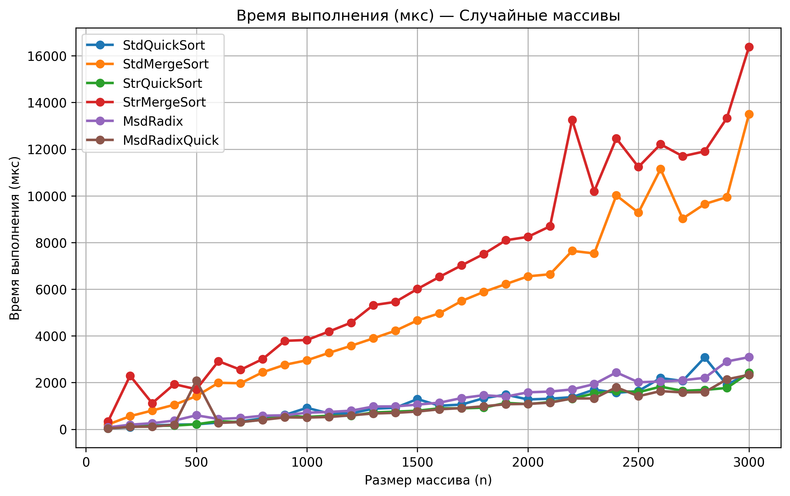
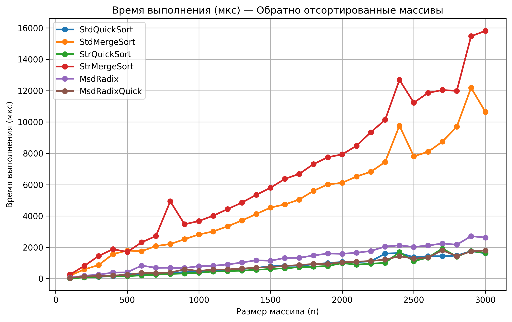
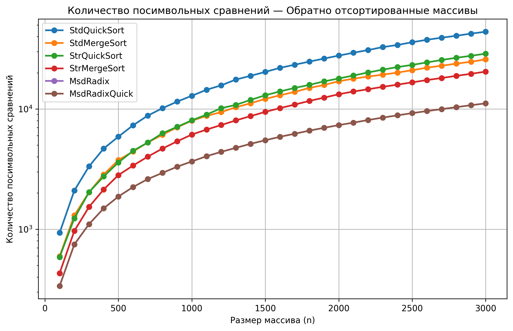
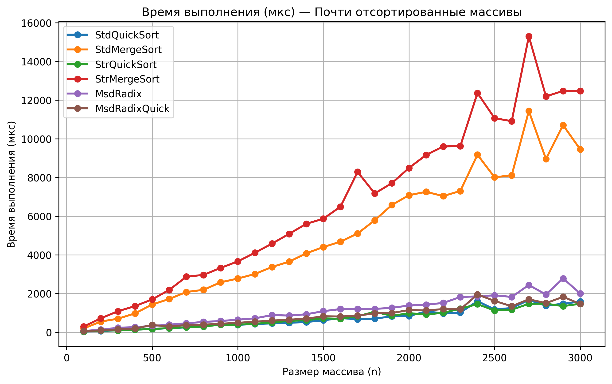
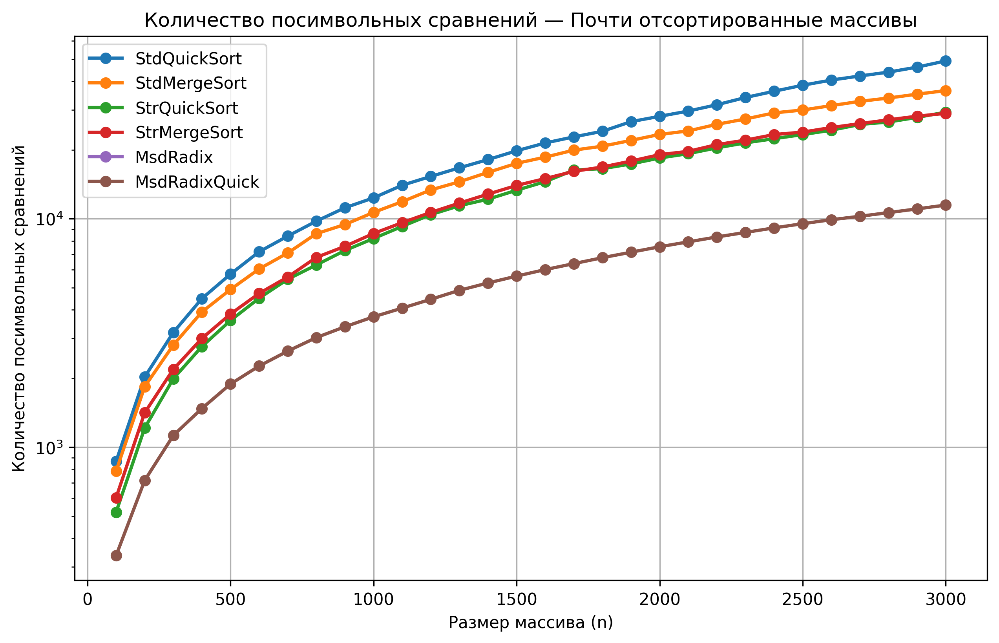

# A1 — Анализ строковых сортировок

## Структура репозитория

- `main.cpp` — основная программа для проведения экспериментов
- `results.csv` — результаты эмпирических замеров
- `main.py` — построение графиков
- `*_time_us.png` — графики времени выполнения
- `*_char_cmps.png` — графики количества посимвольных сравнений

---

## Исследуемые алгоритмы

- Standard QuickSort
- Standard MergeSort
- String QuickSort
- String MergeSort (LCP)
- MSD Radix Sort
- MSD Radix + String QuickSort

---

## Типы тестовых массивов

- случайные
- обратно отсортированные
- почти отсортированные
- массивы с общими префиксами

---

## Посылки на Codeforces

| Задача | ID посылки | Результат |
|--------|-----------|-----------|
| A1m — STRING MERGE SORT | 375981746 | Полное решение: 5 баллов |
| A1q — STRING QUICK SORT | 375981832 | Полное решение: 4 балла |
| A1r — MSD RADIX SORT | 375981871 | Полное решение: 4 балла |
| A1rq — MSD RADIX+QUICK SORT | 375981888 | Полное решение: 3 балла |

---

# Графики

## Случайные массивы — время выполнения

**Рисунок 1.** Время выполнения алгоритмов на случайных массивах

---

## Случайные массивы — посимвольные сравнения

**Рисунок 2.** Количество посимвольных сравнений на случайных массивах

---

## Обратно отсортированные массивы — время выполнения

**Рисунок 3.** Время выполнения алгоритмов на обратно отсортированных массивах

---

## Обратно отсортированные массивы — посимвольные сравнения

**Рисунок 4.** Количество посимвольных сравнений на обратно отсортированных массивах

---

## Почти отсортированные массивы — время выполнения

**Рисунок 5.** Время выполнения алгоритмов на почти отсортированных массивах

---

## Почти отсортированные массивы — посимвольные сравнения

**Рисунок 6.** Количество посимвольных сравнений на почти отсортированных массивах

---

## Массивы с общими префиксами — время выполнения

**Рисунок 7.** Время выполнения алгоритмов на массивах с общими префиксами

---

## Массивы с общими префиксами — посимвольные сравнения

**Рисунок 8.** Количество посимвольных сравнений на массивах с общими префиксами

---

# Выводы

- Наибольший выигрыш адаптированных алгоритмов виден на массивах с общими префиксами: StdQuickSort делает около 500 000 посимвольных сравнений при n=3000, тогда как StrQuickSort — около 70 000, то есть в 7–8 раз меньше.
- MSD Radix Sort не выполняет посимвольных сравнений вовсе, а MsdRadixQuick делает их меньше всех среди сравнивающих алгоритмов (около 14 000 против около 55 000 у StdQuickSort на случайных массивах при n=3000).
- StrMergeSort экономит сравнения, но медленнее остальных по времени из-за накладных расходов на пересчёт lcp-массива.
- StdMergeSort стабильно медленнее StdQuickSort в 3–5 раз на всех типах массивов.
- Переключение MsdRadix на StrQuickSort при малых подмассивах сокращает число сравнений, но на времени выполнения сказывается незначительно.
