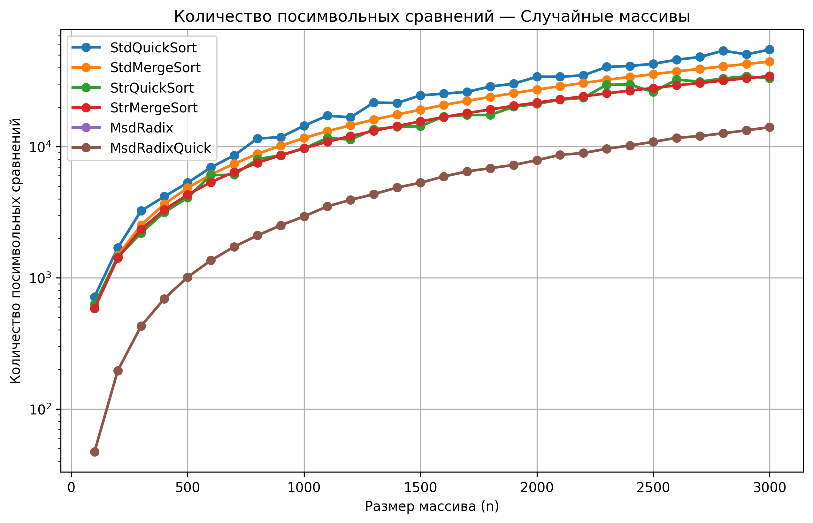
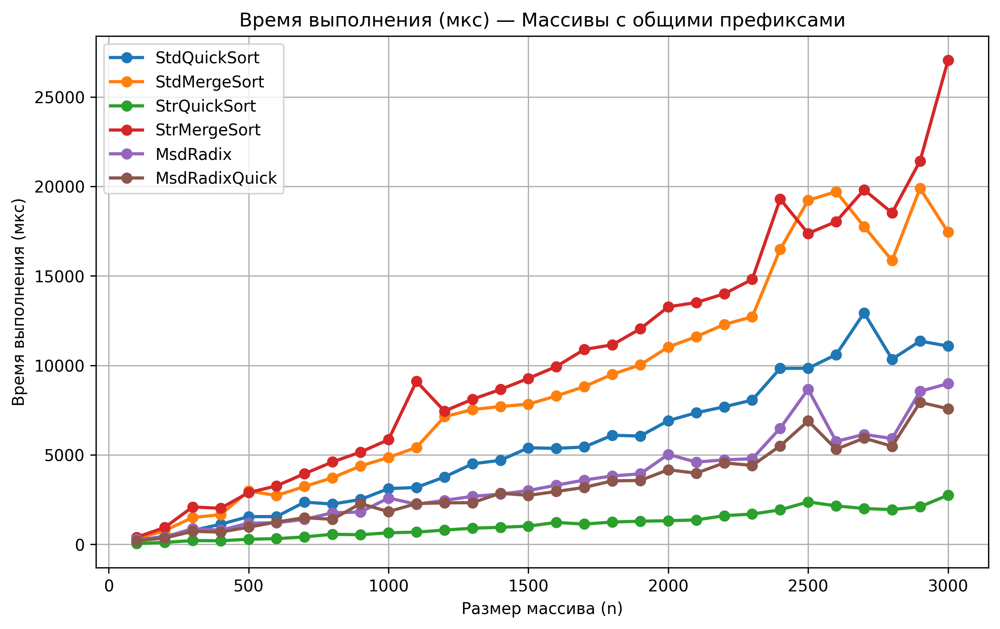
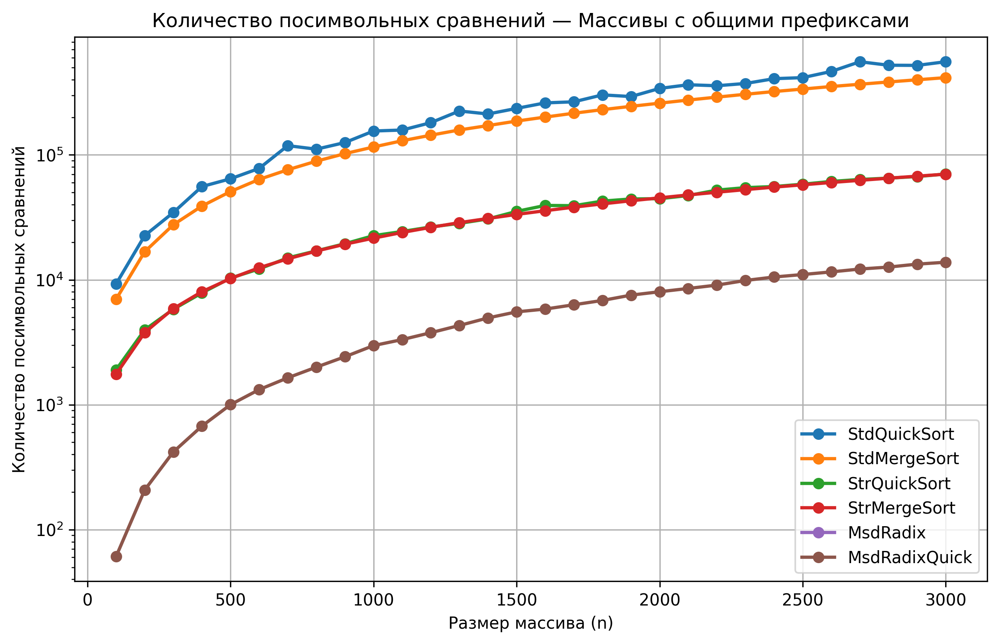

# A1 — Анализ строковых сортировок

## Структура репозитория

- `main.cpp` — основная программа для проведения экспериментов
- `results.csv` — результаты эмпирических замеров
- `main.py` — построение графиков
- `*_time_us.png` — графики времени выполнения
- `*_char_cmps.png` — графики количества посимвольных сравнений

---

## Исследуемые алгоритмы

- Standard QuickSort
- Standard MergeSort
- String QuickSort
- String MergeSort (LCP)
- MSD Radix Sort
- MSD Radix + String QuickSort

---

## Типы тестовых массивов

- случайные
- обратно отсортированные
- почти отсортированные
- массивы с общими префиксами

---

# Графики

## Случайные массивы — время выполнения

  

  <b>Рисунок 1.</b> Время выполнения алгоритмов на случайных массивах

---

## Случайные массивы — посимвольные сравнения

  

  <b>Рисунок 2.</b> Количество посимвольных сравнений на случайных массивах

---

## Массивы с общими префиксами — время выполнения

  

  <b>Рисунок 3.</b> Время выполнения алгоритмов на массивах с общими префиксами

---

## Массивы с общими префиксами — посимвольные сравнения

  

  <b>Рисунок 4.</b> Количество посимвольных сравнений на массивах с общими префиксами

---

# Выводы

- Специализированные строковые сортировки показали более эффективную работу по сравнению со стандартными алгоритмами.
- На массивах с общими префиксами преимущество String QuickSort, String MergeSort и MSD Radix Sort стало наиболее заметным.
- MSD Radix Sort показал минимальное количество посимвольных сравнений на больших массивах.
- Стандартные QuickSort и MergeSort выполняли большее количество сравнений символов, особенно при наличии длинных общих префиксов.
